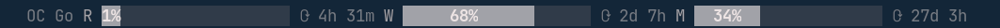

# pi-go-bars

<p align="center">
  <a href="https://opensource.org/licenses/MIT"></a>
  <a href="package.json">=18" src="https://img.shields.io/badge/node-%3E%3D18-brightgreen"></a>
  <a href="https://github.com/donrami/pi-go-bars"></a>
  <a href="https://pi.dev"></a>
</p>

[pi](https://pi.dev) extension that shows Opencode Go plan usage as a widget line between the editor and the footer. Rolling, weekly, and monthly windows are rendered as inline percentage bars using the terminal's muted theme colour.

Optionally, it can also show your **Zen pay-as-you-go** balance and monthly spend alongside the Go bars — off by default, see [Zen Billing](#zen-pay-as-you-go-billing-optional).



## Install

```bash
git clone https://github.com/donrami/pi-go-bars.git
cd pi-go-bars
pi install .
```

## Quick Start

### Option 1: Environment Variables (Recommended)

Credentials stay in memory only.

```bash
export OPENCODE_GO_WORKSPACE_ID="wrk_YOUR_WORKSPACE_ID"
export OPENCODE_GO_AUTH_COOKIE="Fe26.2**YOUR_AUTH_COOKIE"
# Optional: also show Zen pay-as-you-go billing (off by default)
export OPENCODE_GO_SHOW_ZEN=1
```

Add to your shell profile (`~/.bashrc`, `~/.zshrc`), run `source ~/.bashrc` (or `~/.zshrc`), and restart pi.

### Option 2: JSON Config File

```bash
mkdir -p ~/.pi/agent
cat > ~/.pi/agent/pi-go-bars.json << 'EOF'
{
  "workspaceId": "wrk_YOUR_WORKSPACE_ID",
  "authCookie": "Fe26.2**YOUR_AUTH_COOKIE",
  "showZen": false
}
EOF
chmod 600 ~/.pi/agent/pi-go-bars.json
```

Set `"showZen": true` (or `export OPENCODE_GO_SHOW_ZEN=1`) to enable the Zen billing segment.

Restart pi.

### Setup Guide

Run `/gobars-setup` inside pi to display the setup instructions. This prints the same credential and config guidance found below — it does not perform any configuration or initiate an interactive flow.

### Migration from opencode-go-usage

If you previously used the `opencode-go-usage` plugin, pi-go-bars will
automatically read your existing config from:
- `~/.config/opencode/opencode-go-usage.json`
- `~/.opencode/opencode-go-usage.json`

To migrate permanently, run `/gobars-setup` and choose the persistent JSON option.

## Getting Your Credentials

### Workspace ID

1. Open [https://opencode.ai](https://opencode.ai) and navigate to your Go workspace.
2. Copy the ID from the URL:

```
https://opencode.ai/workspace/wrk_XXXXXXXXXXXXXXXX/go
                              ^^^^^^^^^^^^^^^^^^^^
```

### Auth Cookie

1. Open browser Dev Tools (**F12**).
2. Go to **Application** → **Storage** → **Cookies** → `opencode.ai`.
3. Find the cookie named `auth` and copy its value (starts with `Fe26.2**`).

## Usage

When configured, a centred widget line appears between the editor and the footer:

```
         Go  R ██████42%██████  W ██████17%██████  M ████8%██████████
```

`R`, `W`, and `M` show rolling (5-hour), weekly (7-day), and monthly (30-day) usage. Percentages render in bold inside muted-theme bars. Reset countdowns (`⟳ 4h`) tick down live on every render.

Bar widths scale with the terminal (max 20 chars, min 3). On narrow terminals the display degrades gracefully: countdowns drop when bars would shrink below 5 chars, then window labels drop below 3 chars. Nothing overflows.

At **0%** no bar segment is drawn and the text appears dim.

| Symbol | Meaning |
|---|---|
| `R` | Rolling usage (5-hour window) |
| `W` | Weekly usage (7-day window) |
| `M` | Monthly usage (30-day window) |
| `⟳` | Reset countdown |

### Zen Pay-As-You-Go Billing (optional)

**Off by default.** Enable with `OPENCODE_GO_SHOW_ZEN=1` or `"showZen": true` in the config. It uses the **same** workspace ID and auth cookie — no new credentials — by scraping the workspace `/billing` page in parallel with the `/go` page.

When enabled, a compact Zen segment appears beside the Go bars:

```
Go R ████42%██████ W ██████17%██████ M ████8%██████████   Zen $20.00 $0.00/$50.00
```

It shows **current balance** (`$20.00`) and **this month's spend / monthly limit** (`$0.00/$50.00`). The spend figure colours by percentage of the monthly limit (dim at 0%, green <70%, yellow 70–90%, red ≥90%), mirroring the Go bars. The segment degrades gracefully as the terminal narrows: full → `Zen $20.00` → `$20.00` → hidden.

The `/gobars` detail view gains a **Zen Pay-As-You-Go** section with balance, this-month %/USD/limit, and (if set) auto-reload and monthly-limit lines.

**Units.** The `/billing` SSR stores `balance` and `monthlyUsage` in 1e-8 USD ("microcents" — e.g. `1999960750` → `$20.00`), while `monthlyLimit`, `reloadAmount`, and `reloadTrigger` are whole USD. `parseBilling` normalises both to USD.

When not opted in, the extension makes **no** `/billing` request and renders nothing extra — the Go-only behaviour is unchanged.

### Commands

| Command | Description |
|---|---|
| `/gobars` | Open detail view with full-width 16-char bars for all three windows (and the Zen billing section, if enabled) |
| `/gobars-setup` | Display setup instructions (text only, non-interactive) |

## How It Works

**Display.** The widget is rendered via `ctx.ui.setWidget()` with `placement: "belowEditor"`. This avoids the overflow issues that can occur when `ctx.ui.setStatus()` competes with custom footers.

**Bar rendering.** A `UsageWidget` component recalculates widths on every render from the current terminal dimensions. Percentage text is embedded inside the bar as a bold cutout on the muted background.

**Graceful degradation.** If the terminal is too narrow for the full display, countdowns are hidden first (bars < 5 chars), then window labels (bars < 3 chars).

**Countdowns.** Reset times are adjusted by elapsed time since `fetchedAt` on every render, so they count down live without polling.

**Polling.** Data is fetched every 30 seconds. A 90-second cache TTL means most polls return cached data without a network request. The widget re-renders on every poll tick, `turn_start`, and `model_select`.

**Data source.** The extension scrapes the Opencode Go dashboard (`https://opencode.ai/workspace/{id}/go`) and parses the SolidJS SSR hydration output to extract `rollingUsage`, `weeklyUsage`, and `monthlyUsage` objects containing `usagePercent` and `resetInSec`. This will be replaced by the official API endpoint (`/zen/go/v1/usage`) once it is available (see [opencode#16513](https://github.com/anomalyco/opencode/pull/16513)).

**Zen billing data source.** When opted in, the workspace `/billing` page is scraped in parallel. Its SolidJS hydration object is located by anchoring on `customerID:"cus_..."` and depth-counting to the matching `}` (the object nests `lite:$R[N]={...}`), then `balance`, `monthlyUsage`, `monthlyLimit`, and reload fields are parsed within that substring. This anchoring prevents a future component on `/billing` that exposes its own `balance:` field from being silently matched. The official `GET /zen/v1/balance` endpoint ([opencode#10448](https://github.com/anomalyco/opencode/issues/10448)) would replace this scrape when it ships.

## Troubleshooting

### "No config" error

Run `/gobars-setup` to re-read the setup instructions, or verify your environment variables:

```bash
echo $OPENCODE_GO_WORKSPACE_ID
echo $OPENCODE_GO_AUTH_COOKIE
```

### "HTTP 401" or "HTTP 403" error

Your auth cookie is likely expired. Copy a fresh cookie from browser Dev Tools and update your config.

### "stale data" warning

The live fetch failed but cached data is available. Check your network connection and cookie freshness. The stale badge disappears once a fetch succeeds.

### "parser may be outdated" error

Opencode may have changed their dashboard HTML. This can come from either the `/go` scrape (Go usage windows) or the `/billing` scrape (Zen billing, if enabled). Reinstall from source:

```bash
cd /path/to/pi-go-bars
git pull
pi install .
```

If the problem persists, [open an issue](https://github.com/donrami/pi-go-bars/issues).

### Widget line doesn't appear

1. Run `/gobars` to manually trigger a fetch.
2. Widgets are only rendered in interactive mode. They won't appear in print (`-p`) or RPC mode.
3. Check pi's logs for extension errors.

## Programmatic Usage

If you are building another pi extension, you can import utilities from `pi-go-bars`:

```ts
import { clampPercent, renderBar } from "pi-go-bars/extensions/pi-go-bars/core";
```

The following helpers are exported from `core.ts` for stable reuse:

| Function | Purpose |
|---|---|
| `clampPercent(value)` | Clamp to 0–100 and round |
| `colorForPercent(value)` | Returns `"success"`, `"warning"`, or `"error"` |
| `renderBar(theme, value, width?)` | Colored bar string |
| `renderPercent(theme, value)` | Colored percent string |
| `formatDuration(seconds)` | Human-readable countdown |
| `formatUsd(value)` | Format a USD amount as `$20.00` |
| `parseBilling(html)` | Parse `/billing` SSR HTML into `ZenBillingData` |
| `parseDashboard(html)` | Parse `/go` SSR HTML into `GoUsageData` |
| `loadConfig(path?)` | Load config from env → `.env` → JSON → legacy paths |
| `writeConfig(config, path?)` | Atomic config write with `chmod 600` |

## Tests

Parser and config unit tests use Node's built-in test runner (no extra dependencies):

```bash
npm test
```

Covers `parseBilling` (real SSR fixture, a decoy-`balance` false-match guard, login redirect, parser-rot detection, nested-object depth), `parseDashboard` regression guards, `formatUsd`, and the `showZen` opt-in config flag. Fixtures under `extensions/pi-go-bars/testdata/` are sanitised (no real Stripe IDs).

## License

MIT
